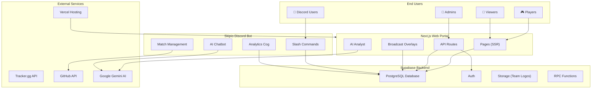

# FLV Portal — System Architecture

## High-Level Overview

The FLV (French League Valorant) Portal is a tournament management ecosystem consisting of three main subsystems:

1. **Web Portal** — A Next.js 16 application for public-facing tournament data
2. **Discord Bot** (Skipio) — A Python bot for community interaction and data entry
3. **Supabase Backend** — PostgreSQL database with auth, storage, and real-time capabilities



---

## Technology Stack

| Layer | Technology | Version | Purpose |
|-------|-----------|---------|---------|
| **Framework** | Next.js | 16.1.6 | SSR/SSG web application |
| **UI Library** | React | 19.2.3 | Component rendering |
| **Language** | TypeScript | ^5 | Type-safe development |
| **Styling** | Tailwind CSS | v4 | Utility-first CSS |
| **Animations** | Framer Motion | ^12.34.0 | Scroll & interaction animations |
| **3D** | Three.js + R3F | ^0.182.0 | Broadcast overlay effects |
| **Database** | Supabase (PostgreSQL) | — | Data persistence & auth |
| **Icons** | Lucide React | ^0.575.0 | UI iconography |
| **Charts** | Recharts | ^3.7.0 | Data visualization |
| **Bot** | discord.py | — | Discord integration |
| **AI** | Google Gemini | — | AI analyst & chatbot |
| **Hosting** | Vercel | — | Edge deployment |

---

## Directory Structure

```
new_app_repo/
├── src/
│   ├── app/                    # Next.js App Router
│   │   ├── (main)/             # Main site layout group
│   │   │   ├── page.tsx        # Landing page (server)
│   │   │   ├── LandingClient.tsx  # Landing page (client animations)
│   │   │   ├── layout.tsx      # Main layout (ambient effects, AI)
│   │   │   ├── admin/          # Admin panel
│   │   │   ├── broadcast/      # Broadcast control hub
│   │   │   ├── leaderboard/    # Player leaderboard
│   │   │   ├── matches/        # Match browser
│   │   │   ├── players/        # Player profiles & comparison
│   │   │   ├── playoffs/       # Playoff bracket
│   │   │   ├── predictions/    # Match predictions
│   │   │   ├── skipio/         # Skipio ELO system
│   │   │   ├── standings/      # Team standings
│   │   │   ├── substitutions/  # Roster substitutions
│   │   │   ├── summary/        # Match summary
│   │   │   └── teams/          # Team profiles & comparison
│   │   ├── (overlays)/         # Broadcast overlay layout (no Navbar)
│   │   │   └── overlay/        # OBS-ready overlays
│   │   │       ├── matchup/
│   │   │       ├── player-comparison/
│   │   │       ├── playoffs/
│   │   │       └── standings/
│   │   ├── api/                # Server-side API routes
│   │   │   ├── activity/       # Site activity tracking
│   │   │   ├── admin/          # Admin CRUD operations
│   │   │   ├── chat/           # AI analyst chat
│   │   │   ├── github/         # GitHub match JSON integration
│   │   │   ├── model/          # ML model management
│   │   │   ├── predict/        # Match prediction
│   │   │   ├── predictions/    # Upcoming predictions
│   │   │   └── site/           # Feature flags
│   │   ├── globals.css         # Design system & animations
│   │   └── layout.tsx          # Root layout (fonts, metadata)
│   ├── components/             # Reusable React components
│   │   ├── Navbar.tsx          # Navigation (scroll-reactive)
│   │   ├── AIAnalyst.tsx       # Floating AI chat widget
│   │   ├── ScrollReveal.tsx    # Scroll animation wrapper
│   │   ├── AnimatedCounter.tsx # Count-up number animation
│   │   ├── ParticleField.tsx   # Ambient particle system
│   │   ├── FeatureCard.tsx     # Bento-grid feature cards
│   │   ├── SeasonSelector.tsx  # Season dropdown
│   │   └── ... (20+ components)
│   ├── lib/                    # Core business logic
│   │   ├── data.ts             # All Supabase queries (3400+ lines)
│   │   ├── supabase.ts         # Supabase client & types
│   │   ├── supabaseServer.ts   # Server-side Supabase client
│   │   ├── adminAuth.ts        # Admin JWT authentication
│   │   ├── ai/                 # AI integration
│   │   │   ├── chat.ts         # Gemini chat logic
│   │   │   ├── db.ts           # AI context database queries
│   │   │   └── snapshot.ts     # AI data snapshot generation
│   │   ├── features/           # ML feature engineering
│   │   │   ├── buildFeatures.ts
│   │   │   └── buildDynamicFeatures.ts
│   │   └── model/              # Prediction model
│   │       ├── infer.ts
│   │       ├── registry.ts
│   │       └── old_predictor.ts
│   └── proxy.ts                # Middleware proxy
├── Skipio-bot/                 # Discord bot (Python)
├── training/                   # ML model training (Python)
├── tools/                      # Utility scripts
│   ├── season-transition/      # Season migration tooling
│   └── one-time/               # Archived debug scripts
├── docs/                       # Documentation
└── public/                     # Static assets
```

---

## Route Map

### Public Pages (`(main)` layout group)

| Route | File | Type | Description |
|-------|------|------|-------------|
| `/` | `page.tsx` + `LandingClient.tsx` | SSR | Landing page with scroll experience |
| `/standings` | `standings/page.tsx` | Dynamic | Team standings by group |
| `/matches` | `matches/page.tsx` | Dynamic | Match browser with scoreboards |
| `/leaderboard` | `leaderboard/page.tsx` | Dynamic | Player stat rankings |
| `/players` | `players/page.tsx` | Dynamic | Player search & analytics |
| `/players/compare` | `players/compare/page.tsx` | Dynamic | Head-to-head player comparison |
| `/teams` | `teams/page.tsx` | Dynamic | Team search & analytics |
| `/teams/compare` | `teams/compare/page.tsx` | Dynamic | Head-to-head team comparison |
| `/playoffs` | `playoffs/page.tsx` | Dynamic | Playoff bracket visualization |
| `/skipio` | `skipio/page.tsx` | Dynamic | Skipio ELO leaderboard |
| `/predictions` | `predictions/page.tsx` | Static | Match predictions |
| `/substitutions` | `substitutions/page.tsx` | Dynamic | Roster substitution log |
| `/summary` | `summary/page.tsx` | Static | Match summary tool |
| `/broadcast` | `broadcast/page.tsx` | Static | Broadcast control hub |
| `/admin` | `admin/page.tsx` | Static | Admin panel (auth-gated) |

### Broadcast Overlays (`(overlays)` layout group)

| Route | Purpose |
|-------|---------|
| `/overlay/matchup` | Live matchup overlay for OBS |
| `/overlay/player-comparison` | Side-by-side player stats overlay |
| `/overlay/playoffs` | Playoff bracket overlay |
| `/overlay/standings` | Standings overlay |

### API Routes

See [API_REFERENCE.md](./API_REFERENCE.md) for complete API documentation.

---

## Key Architectural Patterns

### 1. Server/Client Component Split
- **Server Components** (default): Pages that fetch data from Supabase at request time
- **Client Components** (`"use client"`): Interactive UI with state, animations, and event handlers
- Pattern: Server page fetches data → passes as props to client component

### 2. Season-Aware Data Layer
Every data-fetching function in `lib/data.ts` accepts an optional `seasonId` parameter:
- Defaults to the latest season from the `seasons` table
- Supports `"all"` for cross-season aggregate views
- S23 legacy handling: treats `season_id IS NULL` as S23 data

### 3. Layout Groups
- `(main)` — Standard pages with Navbar, AI Analyst, and ambient backgrounds
- `(overlays)` — Bare layout for OBS browser sources (no chrome)

### 4. Admin Authentication
JWT-based auth flow via cookies:
1. Admin logs in via `/api/admin/login`
2. Server sets an HTTP-only cookie with a JWT
3. Subsequent admin API calls validate the JWT via `adminAuth.ts`
