# FLV Portal — Component Map

This document maps all React components, their relationships, and which pages use them.

---

## Component Dependency Tree

```mermaid
graph TD
    subgraph Layout["Layout Layer"]
        RootLayout["layout.tsx (Root)"]
        MainLayout["(main)/layout.tsx"]
        OverlayLayout["(overlays)/layout.tsx"]
    end

    subgraph Shared["Shared Components"]
        Navbar["Navbar.tsx ★"]
        SeasonSelector["SeasonSelector.tsx ★"]
        AIAnalyst["AIAnalyst.tsx ★"]
        ActivityTracker["ActivityTracker.tsx ★"]
        ScrollReveal["ScrollReveal.tsx"]
        AnimatedCounter["AnimatedCounter.tsx"]
        ParticleField["ParticleField.tsx"]
        FeatureCard["FeatureCard.tsx"]
    end

    subgraph Pages["Page Components"]
        Landing["LandingClient.tsx"]
        Standings["StandingsView.tsx"]
        StandingsTabs["StandingsTabs.tsx"]
        Leaderboard["LeaderboardFilters.tsx"]
        LeaderboardPodium["LeaderboardPodium.tsx"]
        Players["PlayerAnalytics.tsx"]
        PlayerSearch["PlayerSearch.tsx"]
        PlayerCompare["PlayerComparison.tsx"]
        Teams["TeamAnalytics.tsx"]
        TeamSearch["TeamSearch.tsx"]
        TeamCompare["TeamComparison.tsx"]
        Matches["MatchSearch.tsx"]
        Playoffs["PlayoffsTabs.tsx"]
        BracketSim["BracketSimulator.tsx"]
        Predictions["PlayoffProbability.tsx"]
        Scenarios["ScenarioGenerator.tsx"]
        PlayoffScenarios["PlayoffScenarioGenerator.tsx"]
        Subs["SubstitutionView.tsx"]
        Meta["MetaAnalytics.tsx"]
        Economy["EconomyChart.tsx"]
        DBTools["DatabaseTools.tsx"]
        WinIcons["WinTypeIcons.tsx"]
        Broadcast["BroadcastHubClient.tsx"]
    end

    RootLayout --> MainLayout
    RootLayout --> OverlayLayout
    MainLayout --> Navbar
    MainLayout --> AIAnalyst
    MainLayout --> ActivityTracker
    Navbar --> SeasonSelector

    Landing --> ScrollReveal
    Landing --> AnimatedCounter
    Landing --> ParticleField
    Landing --> FeatureCard

    StandingsTabs --> Standings
    StandingsTabs --> Meta
```



---

## Component Classification

### ★ Global Components (used on every `(main)` page)

| Component | Type | Description |
|-----------|------|-------------|
| `Navbar.tsx` | Client | Scroll-reactive navigation with season selector |
| `SeasonSelector.tsx` | Client | Season dropdown (used inside Navbar) |
| `AIAnalyst.tsx` | Client | Floating AI chat widget (bottom-right) |
| `ActivityTracker.tsx` | Client | Invisible component that pings `/api/activity` |

### Landing Page Components

| Component | Type | Description |
|-----------|------|-------------|
| `ScrollReveal.tsx` | Client | Scroll-triggered fade/slide animation wrapper |
| `AnimatedCounter.tsx` | Client | Count-up animation for stats |
| `ParticleField.tsx` | Client | CSS particle system for ambient background |
| `FeatureCard.tsx` | Client | Bento-grid feature showcase card |

### Standings & Analytics

| Component | Type | Used On |
|-----------|------|---------|
| `StandingsTabs.tsx` | Client | `/standings` |
| `StandingsView.tsx` | Client | `/standings` (via StandingsTabs) |
| `MetaAnalytics.tsx` | Client | `/standings` (via StandingsTabs) |
| `EconomyChart.tsx` | Client | Match details, team analytics |

### Leaderboard

| Component | Type | Used On |
|-----------|------|---------|
| `LeaderboardFilters.tsx` | Client | `/leaderboard` |
| `LeaderboardPodium.tsx` | Client | `/leaderboard` (via LeaderboardFilters) |

### Player Pages

| Component | Type | Used On |
|-----------|------|---------|
| `PlayerSearch.tsx` | Client | `/players` |
| `PlayerAnalytics.tsx` | Client | `/players` (after selection) |
| `PlayerComparison.tsx` | Client | `/players/compare` |

### Team Pages

| Component | Type | Used On |
|-----------|------|---------|
| `TeamSearch.tsx` | Client | `/teams` |
| `TeamAnalytics.tsx` | Client | `/teams` (after selection) |
| `TeamComparison.tsx` | Client | `/teams/compare` |

### Match & Playoff

| Component | Type | Used On |
|-----------|------|---------|
| `MatchSearch.tsx` | Client | `/matches` |
| `PlayoffsTabs.tsx` | Client | `/playoffs` |
| `BracketSimulator.tsx` | Client | `/playoffs` (via PlayoffsTabs) |
| `PlayoffProbability.tsx` | Client | `/predictions` |
| `ScenarioGenerator.tsx` | Client | `/predictions` |
| `PlayoffScenarioGenerator.tsx` | Client | `/predictions` |
| `WinTypeIcons.tsx` | Client | Match details |

### Admin & Broadcast

| Component | Type | Used On |
|-----------|------|---------|
| `DatabaseTools.tsx` | Client | `/admin` |
| `SubstitutionView.tsx` | Client | `/substitutions` |
| `BroadcastHubClient.tsx` | Client | `/broadcast` |

---

## Server vs Client Components

### Server Components (render on the server, no JavaScript shipped)
All **page.tsx** files in the `(main)` group are server components. They:
- Fetch data directly from Supabase using `lib/data.ts`
- Pass data as props to client components
- Handle `searchParams` for season filtering

### Client Components (`"use client"`)
All components in `src/components/` are client components. They:
- Handle user interactions (clicks, hovers, animations)
- Use React hooks (`useState`, `useEffect`, `useRef`)
- Use framer-motion for animations
- May call API routes for mutations

### Pattern Example

```tsx
// Server: src/app/(main)/standings/page.tsx
export default async function StandingsPage({ searchParams }) {
    const data = await getStandings(searchParams.season);
    return <StandingsTabs data={data} />; // Client component
}

// Client: src/components/StandingsTabs.tsx
"use client";
export default function StandingsTabs({ data }) {
    const [activeTab, setActiveTab] = useState("standings");
    return /* interactive UI */;
}
```
