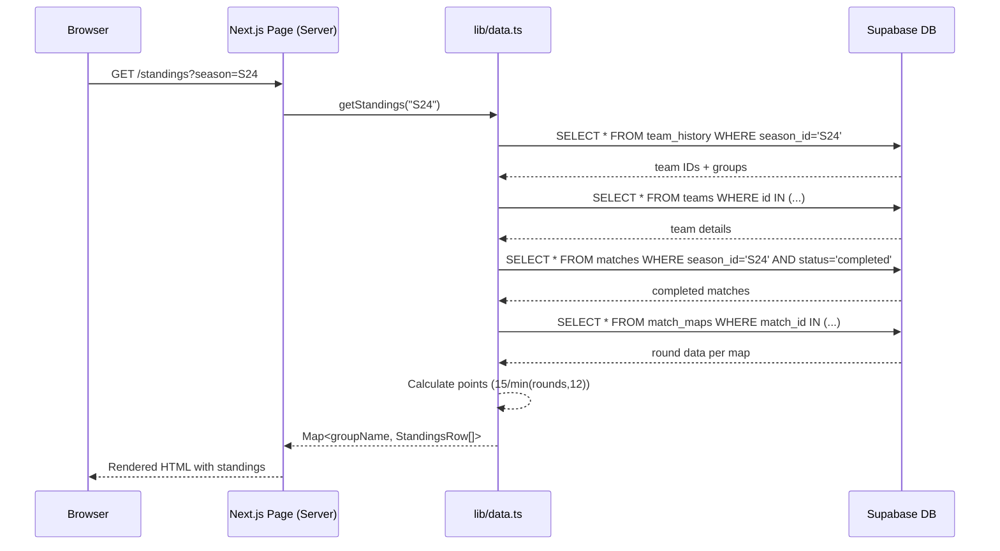

# FLV Portal — Data Flow

This document explains how data flows through the application, from the Supabase database to the user's screen.

---

## Database Schema

```mermaid
erDiagram
    SEASONS {
        text id PK "e.g. S24"
        text name "Season 24"
        boolean is_active
    }

    TEAMS {
        int id PK
        text tag "Team abbreviation"
        text name "Full team name"
        text group_name "Group A, B, etc."
        text captain
        text logo_path
    }

    PLAYERS {
        int id PK
        text name
        text riot_id "Tag#Line"
        text rank "Current rank"
        text uuid "Tracker UUID"
        int default_team_id FK
    }

    MATCHES {
        int id PK
        int week
        text group_name
        int team1_id FK
        int team2_id FK
        int winner_id FK
        text status "scheduled|completed|live"
        text format "BO1|BO3|BO5"
        int maps_played
        text match_type "regular|playoff"
        int playoff_round
        int bracket_pos
        text season_id FK
        int score_t1
        int score_t2
    }

    MATCH_MAPS {
        int id PK
        int match_id FK
        int map_index
        text map_name
        int team1_rounds
        int team2_rounds
        int winner_id
    }

    MATCH_STATS_MAP {
        int id PK
        int match_id FK
        int map_index
        int player_id FK
        int team_id FK
        text agent
        int acs
        int kills
        int deaths
        int assists
        float adr
        float kast
        float hs_pct
        int fk
        int fd
        int plants
        int defuses
        int clutches
        int survived
    }

    TEAM_HISTORY {
        int id PK
        int team_id FK
        text season_id FK
        text group_name
    }

    PLAYER_HISTORY {
        int id PK
        int player_id FK
        text season_id FK
        text rank
    }

    PLAYER_TEAM_HISTORY {
        int id PK
        int player_id FK
        int team_id FK
        text season_id FK
        boolean is_current
    }

    MATCH_SUBSTITUTIONS {
        int id PK
        int match_id FK
        int map_index
        int original_player_id FK
        int sub_player_id FK
        int team_id FK
    }

    SEASONS ||--o{ MATCHES : "season_id"
    SEASONS ||--o{ TEAM_HISTORY : "season_id"
    SEASONS ||--o{ PLAYER_HISTORY : "season_id"
    TEAMS ||--o{ MATCHES : "team1_id / team2_id"
    TEAMS ||--o{ TEAM_HISTORY : "team_id"
    PLAYERS ||--o{ MATCH_STATS_MAP : "player_id"
    PLAYERS ||--o{ PLAYER_HISTORY : "player_id"
    MATCHES ||--o{ MATCH_MAPS : "match_id"
    MATCHES ||--o{ MATCH_STATS_MAP : "match_id"
    MATCHES ||--o{ MATCH_SUBSTITUTIONS : "match_id"
```

---

## Data Fetching Flow



---

## Core Data Functions (`lib/data.ts`)

The `data.ts` file (~3400 lines) is the heart of the data layer. All functions accept an optional `seasonId` parameter for multi-season support.

### Season Management

| Function | Returns | Description |
|----------|---------|-------------|
| `getDefaultSeason()` | `string` | Returns the latest season ID (e.g. "S24") |
| `getSeasons()` | `Season[]` | All seasons + synthetic "All Time" entry |

### Standings & Team Data

| Function | Returns | Description |
|----------|---------|-------------|
| `getStandings(seasonId?)` | `Map<string, StandingsRow[]>` | Grouped standings with W/L/Points/PD |
| `getTeamPerformance(teamId, seasonId?)` | `TeamPerformance` | Full team analytics |
| `getGlobalStats(seasonId?)` | `GlobalStats` | Active teams, matches, players, points |

### Player Data

| Function | Returns | Description |
|----------|---------|-------------|
| `getLeaderboard(minGames?, matchType?, seasonId?)` | `LeaderboardPlayer[]` | Ranked player stats |
| `getPlayerStats(playerId, seasonId?)` | `PlayerStats` | Individual player deep stats |
| `getMetaAnalytics(seasonId?)` | `MetaAnalytics` | Agent & map meta analysis |

### Match Data

| Function | Returns | Description |
|----------|---------|-------------|
| `getMatches(seasonId?)` | `MatchEntry[]` | All matches with team details |
| `getMatchDetails(matchId)` | `MatchDetail` | Full scoreboard with per-map stats |
| `parseTrackerJson(json, ...)` | `TrackerResult` | Parse Tracker.gg JSON into match data |

### Prediction & ELO

| Function | Returns | Description |
|----------|---------|-------------|
| `getSkipioLeaderboard(seasonId?)` | `SkipioEntry[]` | ELO rankings with tier labels |
| `determineArchetype(agent)` | `string` | Maps agent to role (Duelist, etc.) |

---

## Points System

The tournament uses a custom points system:

```
Winner:  15 points
Loser:   min(rounds_won, 12) points
Draw:    min(rounds_won, 12) points each
```

**Standings Sort Order:**
1. Total Points (descending)
2. Point Differential — `PD = Points - Points Against` (descending)

---

## Season Filtering Logic

All season-aware queries follow this pattern:

```typescript
// Default: latest season
const activeSeason = seasonId || await getDefaultSeason();
const isAllTime = activeSeason === 'all';

// Build query
let query = supabase.from('matches').select('*').eq('status', 'completed');

if (!isAllTime) {
    // S23 special case: old matches may have NULL season_id
    const filter = activeSeason === 'S23'
        ? 'season_id.eq.S23,season_id.is.null'
        : `season_id.eq.${activeSeason}`;
    query = query.or(filter);
}
```

This pattern is repeated across `getStandings`, `getLeaderboard`, `getMatches`, and all other season-aware functions.

---

## Skipio ELO System

See [SKIPIO_ELO_SYSTEM.md](./SKIPIO_ELO_SYSTEM.md) for the complete mathematical foundation.

**Summary:**
1. Calculate Raw Performance Score (RPS) from ACS, K/D, ADR, KAST
2. Normalize against peer groups (rank-based global avg + lobby avg)
3. Compute ELO: `1000 + (avg_blended - 100) × 20`
4. Tier assignment: Godlike (1400+) → Struggling (<850)
