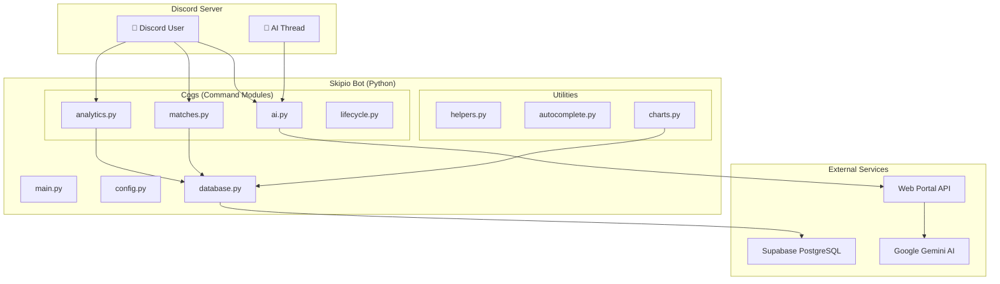

# Skipio Discord Bot — Architecture

The Skipio bot is a **Python Discord bot** (discord.py) that provides slash commands for tournament analytics, match exploration, and AI-powered Q&A — all connected to the same Supabase database as the web portal.

---

## System Overview



---

## File Structure

```
Skipio-bot/
├── main.py              # Bot entry point, loads all cogs
├── config.py            # Environment config (tokens, DB URL)
├── database.py          # PostgreSQL connection pool & season helpers
├── .env                 # Environment variables (gitignored)
├── requirements.txt     # Python dependencies
│
├── cogs/                # Command modules (discord.py extensions)
│   ├── lifecycle.py     # Bot startup, shutdown, command sync
│   ├── analytics.py     # /scout, /standings, /leaderboard, /stats, /player_info, /team_info, /compare_players, /skipio_elo
│   ├── matches.py       # /match_flow, /map_analytics, /meta_stats, /match_result
│   └── ai.py            # /ask_ai, /stats_chart, thread-based AI conversations
│
├── utils/               # Shared utilities
│   ├── helpers.py       # run_in_executor, determine_archetype
│   ├── autocomplete.py  # Autocomplete handlers for player/team/match search
│   └── charts.py        # Matplotlib chart generation (radar, trends, maps)
│
├── ui/                  # Discord UI components
│   ├── views.py         # Interactive button views (match flow, chart controls)
│   └── embeds.py        # Embed builders
│
├── BOT_SETUP.md         # Setup instructions
└── DEPLOYMENT.md        # Deployment guide
```

---

## Slash Commands Reference

### Analytics Cog (`analytics.py`)

| Command | Description | Key Features |
|---------|-------------|-------------|
| `/scout <team>` | Scouting report for a team | Best/worst maps, roster agents, danger players, recent form |
| `/standings <group>` | Group standings | Points system, win rates, point differential |
| `/leaderboard` | Top players by stat | Filter by ACS/KD/ADR/KAST/HS%, rank, role. Min games filter |
| `/stats <player>` | Quick player snapshot | ACS, K/D, ADR, KAST summary |
| `/player_info <player>` | Detailed player profile | Combat stats, impact metrics, agent pool, recent form, radar chart |
| `/team_info <team>` | Team profile | Roster, averages, map pool, recent results |
| `/compare_players` | Head-to-head comparison | Side-by-side stats with radar chart |
| `/skipio_elo` | Skipio ELO rankings | Peer-normalized ELO with tier labels |

### Matches Cog (`matches.py`)

| Command | Description | Key Features |
|---------|-------------|-------------|
| `/match_flow <id>` | Interactive match explorer | Overview → Economy → Performance → Rounds (button navigation) |
| `/match_result <id>` | Quick scoreboard | Score bar, top performers |
| `/map_analytics <team>` | Map win-rate chart | Matplotlib horizontal bar chart |
| `/meta_stats` | League-wide meta | Agent pick rates, map pool breakdown |

### AI Cog (`ai.py`)

| Command | Description | Key Features |
|---------|-------------|-------------|
| `/ask_ai <question>` | AI tournament analyst | Creates thread for follow-up conversation |
| `/stats_chart <player>` | Performance charts | Interactive chart type switching via buttons |

### Lifecycle Cog (`lifecycle.py`)

| Command | Description |
|---------|-------------|
| *(internal)* | Bot startup, graceful shutdown, slash command sync |

---

## Database Layer (`database.py`)

The bot connects to the **same Supabase PostgreSQL database** as the web portal, using `psycopg2` with a connection pool:

- **`UnifiedDBWrapper`** — Wraps psycopg2 connections with auto-return-to-pool
- **`get_conn()`** — Gets a connection from the pool (3 retry attempts)
- **`get_default_season()`** — Reads the active season from the `seasons` table
- **Connection Pool** — `ThreadedConnectionPool(1, 10)` with SSL required

### Season Filtering Pattern
The bot uses the same season filtering pattern as the web portal:
```python
sf = "(m.season_id = %s OR (m.season_id IS NULL AND %s = 'S23'))" if season != 'all' else "1=1"
```

---

## AI Integration

The `/ask_ai` command doesn't call Gemini directly — it proxies through the **web portal's `/api/chat` endpoint**:

```
Discord → /ask_ai → POST portal/api/chat → Gemini AI → Response
```

This ensures the AI has access to the same SQL agent and database context as the web portal's AI Analyst widget.

**Thread-based conversations:** When `/ask_ai` is used, it creates a Discord thread. Subsequent messages in the thread automatically include conversation history, enabling multi-turn AI dialogue.

---

## Chart Generation (`utils/charts.py`)

The bot generates Matplotlib charts as Discord file attachments:

- **Radar Charts** — Player stat comparison (ACS, KD, ADR, KAST, HS%)
- **Performance Trends** — ACS/KD over time (match-by-match line charts)
- **Map Analytics** — Horizontal bar charts for team map win rates

Charts use a dark theme matching the portal's Valorant aesthetic:
- Background: `#0F1923` (val-dark)
- Accent colors: `#FF4655` (val-red), `#3FD1FF` (val-blue)
- Font: Consistent with the portal's design system

---

## Setup & Deployment

### Prerequisites
- Python 3.10+
- Discord bot token with `message_content` intent
- Supabase PostgreSQL connection string
- Web portal URL (for AI proxy)

### Quick Start
```bash
cd Skipio-bot
pip install -r requirements.txt
# Create .env with DISCORD_TOKEN, SUPABASE_DB_URL, PORTAL_URL
python main.py
```

See [BOT_SETUP.md](../Skipio-bot/BOT_SETUP.md) and [DEPLOYMENT.md](../Skipio-bot/DEPLOYMENT.md) for detailed instructions.
